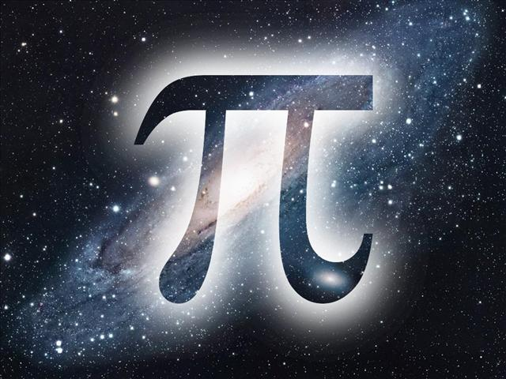

  

# Convertisseur de Devises

Ce projet est un convertisseur de devises simple réalisé en HTML, CSS et JavaScript. Il permet aux utilisateurs de convertir un montant d'une devise à une autre.

## Comment utiliser

1. Clonez ce dépôt sur votre machine locale.
2. Ouvrez le fichier `index.html` dans votre navigateur web.
3. Remplissez le montant que vous souhaitez convertir dans le champ prévu à cet effet.
4. Sélectionnez la devise d'origine dans la première liste déroulante.
5. Sélectionnez la devise de destination dans la deuxième liste déroulante.
6. Cliquez sur le bouton "Convertir" pour obtenir le résultat de la conversion.
7. Le résultat de la conversion s'affichera sous le bouton de conversion.

## Fonctionnalités

- Conversion de devises en temps réel.
- Supporte une variété de devises populaires.

## Auteur

Contactez-moi à [eric.antonie.noel92@gmail.com] pour toute question ou commentaire.

## Contributions

Les contributions sont les bienvenues ! Si vous souhaitez contribuer à ce projet, veuillez ouvrir une nouvelle pull request.
